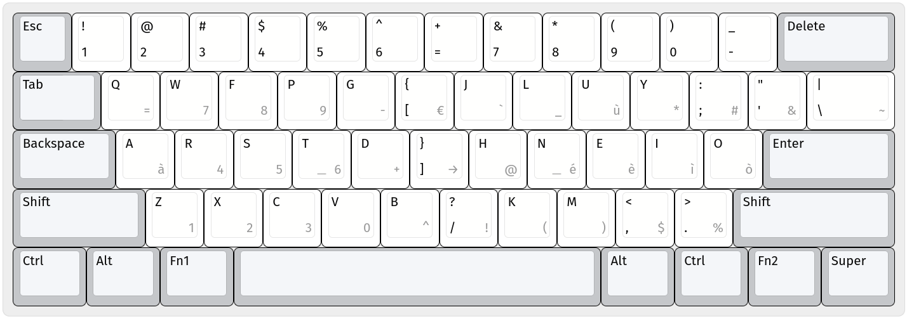

# Keyboard Setup
This repository contains my keyboard layout and setup.

## Features
* Layout based on Colemak with a custom AltGr layer of letters and symbols
* Designed to be efficient, with less finger movements possible
* Arrow keys accessible without moving fingers from home row position
* ...

## Hardware

### Anne Pro 2
TODO

### Laptop
TODO

## Layers

### Right Ctrl layer
TODO

### Fn1 Layer
TODO

## OS

### Windows
TODO

### Linux
TODO

### macOS
TODO

## TODO
- macOS layout
- Complete README
- Complete Fn1 layer
- Add special character not included in the picture
- Create portable layout
