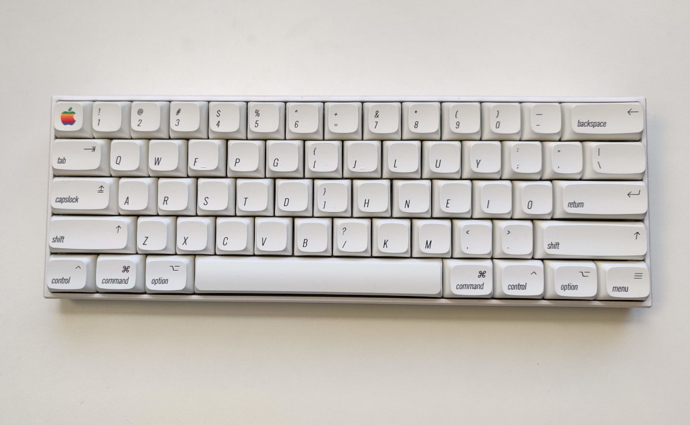
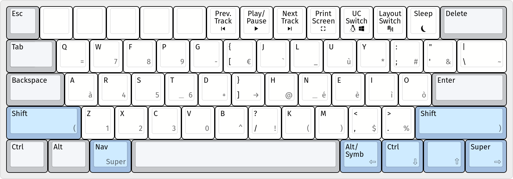
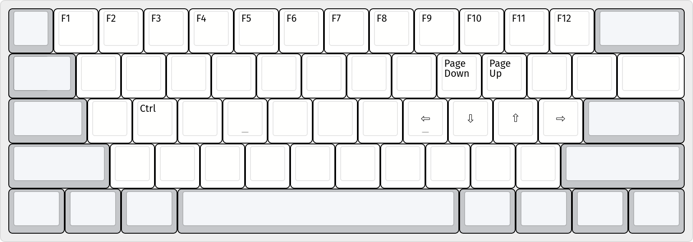

# Keyboard Setup
This repository contains all the information about my keyboard layout and setup.

* Layout based on [Colemak Wide Mod](https://colemakmods.github.io/ergonomic-mods/wide.html) with a custom layer of accented letters, symbols and numbers
* Designed to be efficient, with less finger movements possible
* Arrow keys accessible without moving fingers from home row position with nav layer

## Mechanical Keyboard
### [Anne Pro 2](https://www.annepro.net/products/anne-pro-2) 
With Gateron Brown Switches, powered by [QMK](https://docs.qmk.fm/)
* Adaptive mode: a special layer that adapts the setup to any computer (Windows or Linux) with standard italian QWERTY layout, withuot needing any additional software (except for Windows that needs [WinCompose](https://github.com/samhocevar/wincompose) for characters outside IT QWERTY)

### [Keychron Q1 v2](https://www.keychron.com/products/keychron-q1)

### Default Layer

* **Special keys**
  * `Layout Switch`: switches between **default mode** (preferred mode, used with the Colemak Custom layout installed on the OS) and **adaptive mode** (used with IT QWERTY on the OS)
  * `UC Switch`: for adaptive mode, switches UNICODE insertion mode (used for character not present in IT QWERTY) between Linux (default) and Windows
  * `Nav`: activates the **nav layer** while pressed
  * `Alt/Symb`: used for typing accented letters, symbols and numbers (grey characters on white keys)
    * `Alt` is used in default mode (integrated via software)
    * `Symb` is used for activating **symbols layer** in adaptive mode (integrated via hardware)

* **Tapped keys**
  * Blue keys acts like their black caption while pressed and like their grey caption when tapped

### Nav Layer

* Activated while pressing `Nav`
* All the blank keys in the picture are the same as the default layer

## Layout
Custom Colemak layout with Right Alt layer of accented letters, symbols and numbers.

### Windows
- To install, just extract `windows/colemak_custom.zip` and run then `setup.exe`. Then select *Colemak - Custom* layout under *English (United States)* in settings

### Linux
Override Colemak layout in `/usr/share/X11/xkb/symbols/US` with the one in `colemak_custom.xkb` using the `apply_custom_layout.py` script. Then select *Colemak* layout under *English (US)* in settings

## Todo
- [ ] Script for autoinstalling Colemak Custom in Linux
- [ ] Finish nav layer on AutoHotkey
- [ ] Finish mapping missing keys
- [ ] Script for compiling QMK firmware
- [ ] Firmware binaries
- [ ] New keyboard photo
- [ ] Laptop layout picture (maybe)
- [ ] Explain wide layout (with kbd.h mod)

## Support me!
